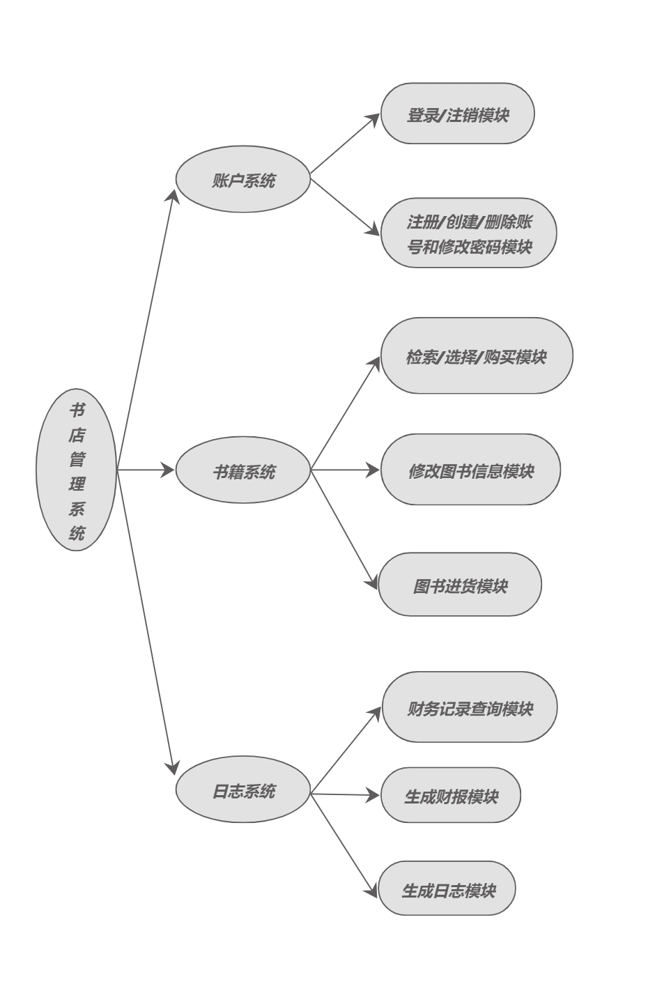

# 总体设计文档
## 一、代码文件结构
- main.cpp
    - 作为程序的主入口点，负责启动程序、执行读入操作和判断操作类型并调用相关函数
- memoryriver.hpp
    - 文件读取函数，包括从main读取和block读取
- block.hpp
    - 实现块状链表存储大量数据操作
- 存储文件
    - index.txt
        - 存块状链表的链表部分
    - block.txt
        - 存储块状链表块的部分
    - 注：这里指的是文件类型，即可以派生（比如可以有block_book.txt等）
## 二、功能设计
- 
## 三、数据库设计
- 用户信息
    - 权限
    - 用户名
    - 密码
    - 采用块状链表存储
- 书籍信息
    - ISBN号码（20个字符）
    - 书名（60个字符）
    - 作者（60个字符）
    - 关键字（不超过60个字符）
    - 库存量（整型）
    - 单价（非负实数）
    - 数量（总数/购买数）
    - 进货价格（进购）
    - 采用块状链表存储
- 日志信息
    - 进购记录
    - 出售记录