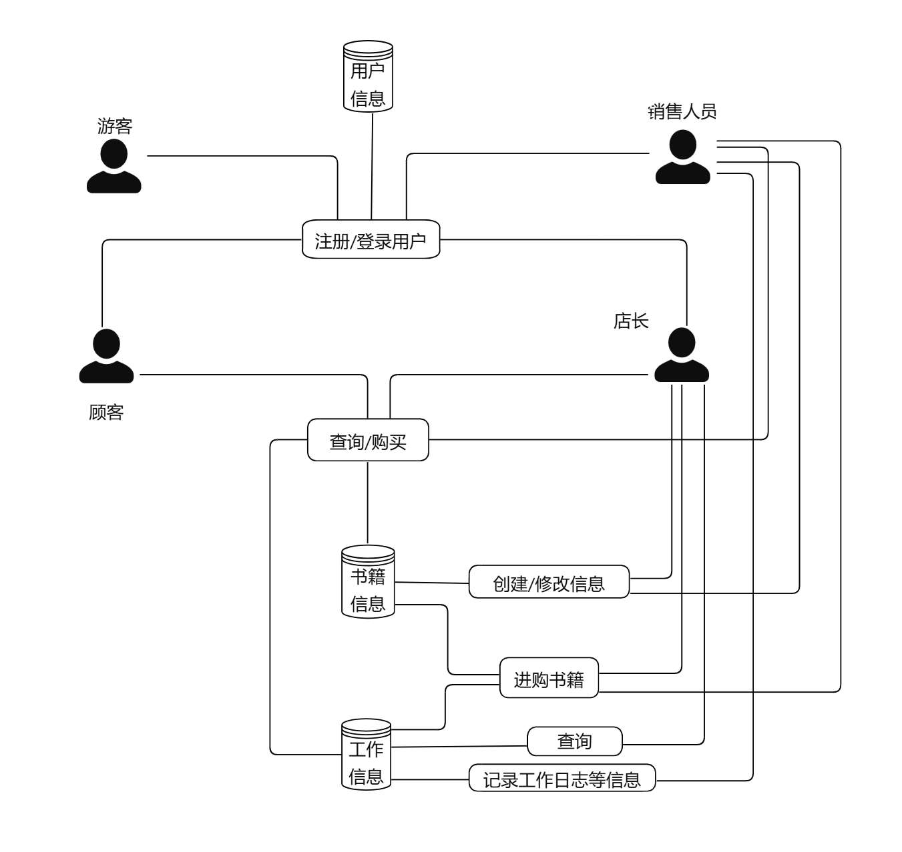
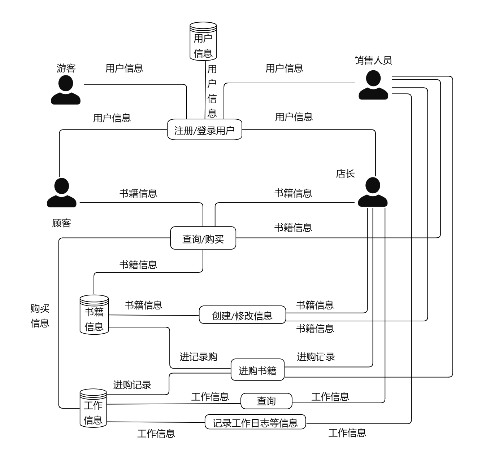

# 需求分析文档

## 业务流程图

## 数据流程图

## 数据词典
- 工作信息包括采购信息，销售信息，盈利信息，工作日志等
- 书籍信息包括ISBN 号（20 个字符，每本正版书都有惟一的标识）、书名（60 个字符）、作者（60 个字符）、关键字（可以有多个，总共不超过 60 个字符）、库存量（整型）、单价（非负实数）
- 进购记录包括：ISBN 号、数量、进货价格
- 购买信息包括：ISBN 号、数量、单价

## 功能说明
- 用户管理：注册登录功能，根据用户身份给予权限
- 书籍信息管理：查询维护书籍信息，包括数量、价格等，并维护进购信息
- 工作信息：供店长查看采购信息，销售情况，盈利信息，工作日志等

## 用户交互设计
#### 注册功能：
- 注册指令：register
- 输入：用户名和密码
- 输出：若成功输出success，失败则输出fail
#### 登录功能
- 注册指令：log
- 输入：用户名和密码
- 输出：若成功输出success，失败则输出fail
#### 查询书籍功能
- 注册指令：find
- 输入：书籍相关信息的索引，及内容（如find ISBN A NAME B author C key D E）
- 输出：若成功输出success，再输出具体信息，失败则输出fail
#### 购买书籍功能
- 注册指令：buy
- 输入：依次输入ISBN 号和数量
- 输出：若成功输出success，否则输出fail
#### 进购书籍功能
- 注册指令：purchase
- 输入：依次输入ISBN 号、数量、进货价格、（关键词）
- 输出：若成功输出success
#### 修改书籍信息功能
- 注册指令：modify
- 输入：依次输入ISBN 号、修改信息的索引，及内容（一次仅修改一个信息）
- 输出：若成功输出success
#### 店长查询功能
- 注册指令：check
- 输入：要查找的信息种类（purchase,sale,profit,worklog或某类上述指令）
- 输出：若成功输出success，并输出对应信息，否则输出fail